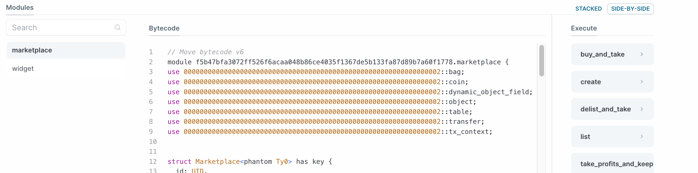

# Deployment and Testing

ต่อไป เราจะทำการ deploy และทดสอบ marketplace ด้วย SUI CLI

เราทำการสร้างโมดูล `marketplace::widget` อย่างง่าย เพื่อให้เราสามารถมิ้นท์ไอเทมเพื่อใช้สร้างรายการขายและใช้ทดสอบ

```move
module marketplace::widget;

public struct Widget has key, store {
    id: UID,
}

#[lint_allow(self_transfer)]
public fun mint(ctx: &mut TxContext) {
    let object = Widget {
        id: object::new(ctx),
    };
    transfer::public_transfer(object, ctx.sender());
}
```

นี่คือโปรเจค Hello World จากบทแรก แต่ทำให้ดูง่ายขึ้น

## Deployment

อย่างแรก เราต้องทำการเผยแพร่ทั้งสองแพ็คเกจด้วย:

```bash
    sui client publish
```

คุณควรจะเห็นทั้งโมดูล `marketplace` และ `widget` ถูกเผยแพร่บน explorer:



Export object ID ของแพ็คเกจเป็น environmental variable:

```bash
    export PACKAGE_ID=<package object ID from previous output>
```

## Initialize the Marketplace

ต่อไป เราต้องทำการเริ่มต้น marketplace contract ด้วยการเรียกฟังก์ชั่น `create` และเราต้องการที่จะส่ง argument เพื่อระบุว่า marketplace จะรับ fungible token ประเภทไหนได้บ้าง วิธีที่ง่ายที่สุดคือใช้ native token ของ `Sui` โดยใช้คำสั่ง CLI ดังนี้:

```bash
    sui client call --function create --module marketplace --package $PACKAGE_ID --type-args 0x2::sui::SUI
```

สังเกตที่ syntax สำหรับการส่งประเภทของ argument ของโทเค็น `SUI`

Export object ID ของ `Marketplace` เป็น environmental variable::

```bash
    export MARKET_ID=<marketplace shared object ID from previous output>
```

## Listing

อย่างแรก เราทำการมิ้นท์ `widget` เพื่อลงรายการขาย:

```bash
    sui client call --function mint --module widget --package $PACKAGE_ID
```

บันทึก object ของ widget ที่มิ้นท์ได้ลงใน environmental variable:

```bash
    export ITEM_ID=<object ID of the widget item from console>
```

จากนั้น ทำการสร้างไอเทมนี้ลงใน marketplace:

```bash
    sui client call --function list --module marketplace --package $PACKAGE_ID --args $MARKET_ID $ITEM_ID 1 --type-args $PACKAGE_ID::widget::Widget 0x2::sui::SUI
```

เราจำเป็นต้องส่ง arguments สองประเภทที่นี่ อย่างแรก คือประเภทของไอเทมที่ถูกลิส และอย่างที่สองคือประเภทของเหรียญสำหรับใช้ชำระเงิน ในตัวอย่างข้างบน การลงรายการขายจะมีราคาเท่ากับ `1`

หลังจากส่งธุรกรรมนี้แล้ว คุณสามารถตรวจสอบรายการที่เพิ่งถูกสร้างได้บน [Sui explorer](https://explorer.sui.io/):


## Purchase

แยก object เหรียญ `SUI` ออกมาเป็นจำนวน `1` เพื่อใช้เป็น object สำหรับทำการชำระเงิน คุณสามารถใช้คำสั่ง CLI `sui client gas` เพื่อดูจำนวนเหรียญ `SUI` ที่เหลือในบัญชี และหยิบมาใช้หนึ่งอัน

```bash
    sui client split-coin --coin-id <object ID of the coin to be split> --amounts 1
```

Export object ID ของเหรียญ `SUI` ที่แยกออกมา `1` เหรียญ:

```bash
    export PAYMENT_ID=<object ID of the split 1 balance SUI coin>
```

_แบบทดสอบ: ในแบบฝึกหัด ทดลองแก้ไขคอนแทรคของ marketplace ให้สามารถรับการชำระเงินได้หากจำนวนคงเหลือเพียงพอกับราคาที่ต้องชำระ แทนการระบุจำนวนไปตรงๆ_

ตอนนี้ มาลองซื้อไอเทมที่เราเพิ่งลงรายการไป:

```bash
    sui client call --function buy_and_take --module marketplace --package $PACKAGE_ID --args $MARKET_ID $ITEM_ID $PAYMENT_ID --type-args $PACKAGE_ID::widget::Widget 0x2::sui::SUI
```

คุณควรจะเห็นรายการยาวเหยียดของผลการทำธุรกรรมในคอนโซลหลังจากส่งคำสั่งนี้ไป เราสามารถตรวจสอบได้ว่าแอดเดรสเราเป็นเจ้าของ `widget` หรือไม่ และตอนนี้ `payment` `Table` จะมีข้อมูลธุรกรรมของเราพร้อมด้วย key ของแอดเดรสเราและมีขนาดเป็น `1`

### Take Profits

สุดท้ายนี้ เราสามารถเคลมรายได้ของเราด้วยการเรียกเมธอด `take_profits_and_keep`:

```bash
    sui client call --function take_profits_and_keep --module marketplace --package $PACKAGE_ID --args $MARKET_ID --type-args 0x2::sui::SUI
```

คำสั่งนี้จะทำการถอนยอดเงินคงเหลือออกมาจาก `payment` `Table` และเปลี่ยนขนาดของมันกลับไปเป็น `0` ตรวจสอบสิ่งนี้ได้บน explorer
