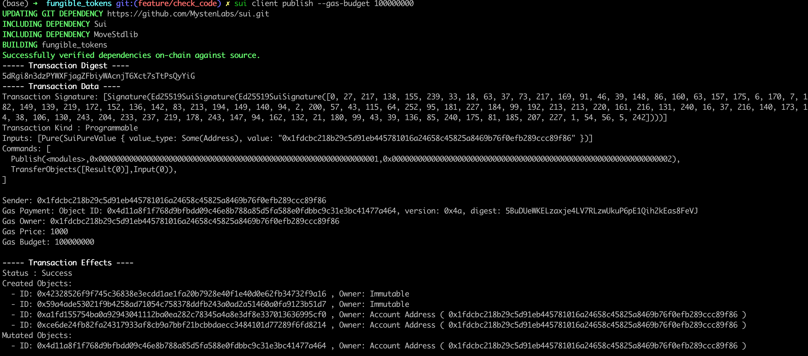
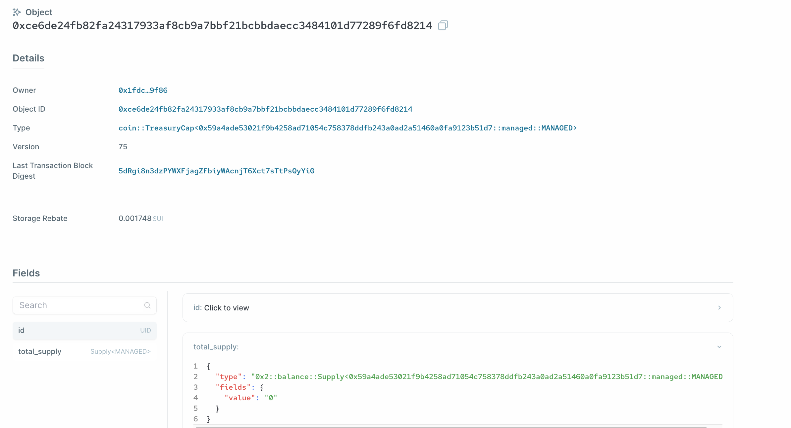
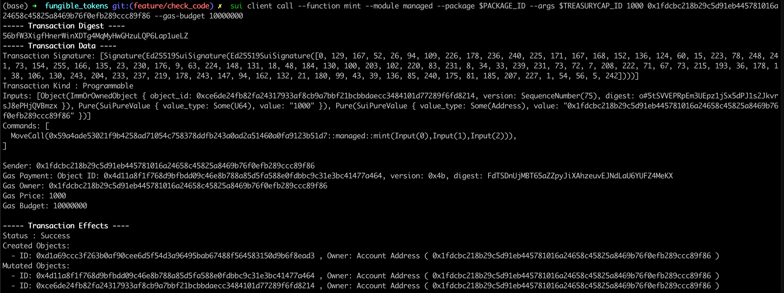
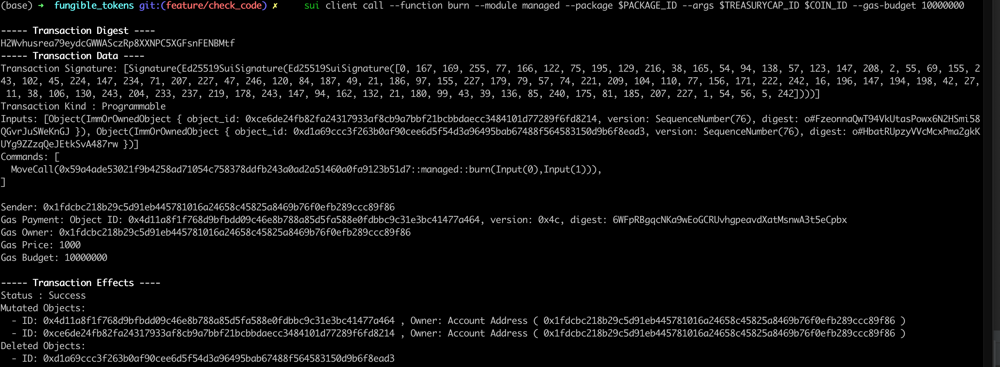

# Managed Coin Example

ตอนนี้ หลังเราได้แอบไปดูการทำงานของโมดูล `sui::coin` แล้ว ซึ่งมันดูง่ายดาย ตัวอย่างการสร้าง custom fungible token ที่สมบูรณ์ ที่มีตัวจัดการที่เชื่อถือได้ ซึ่งมีความสามารถในการ mint และ burn นั้น มีความคล้ายคลึงกับการ implement ERC-20 หลายๆตัว

## Smart Contract

คุณสามารถดูตัวอย่างแบบสมบูรณ์ของ [Managed Coin example contract](../example_projects/fungible_tokens/sources/managed.move) อยู่ภายใต้โฟลเดอร์ example project

จากสิ่งที่เราได้กล่าวถึงไปแล้ว คอนแทรคนี้ควรจะค่อนข้างเข้าใจง่าย มันเหมือนกับ [One Time Witness](./3_witness_design_pattern.md#one-time-witness)ทุกประการ โดยที่ `MANAGED` ก็คือ `witness` และมันถูกสร้างขึ้นโดยอัตโนมัติด้วยฟังก์ชั่น `init`

จากนั้นฟังก์ชั่น `init` ทำการเรียก `coin::create_currency` เพื่อรับค่า `TreasuryCap` และ `CoinMetadata` โดยพารามิเตอร์ที่ส่งให้ฟังก์ชั่นนี้คือฟิลด์ต่างๆของ CoinMetadata ซึ่งประกอบไปด้วยชื่อโทเคน, สัญลักษณ์, URL ของไอคอน และอื่นๆ

หลังจากการสร้าง `CoinMetadata` จะถูกแช่แข็งทันทีด้วยฟังก์ชั่น `transfer::freeze_object` ดังนั้น มันจึงกลายเป็น [shared immutable object](../../unit-two/lessons/2_ownership.md#shared-immutable-objects) ที่สามารถถูกอ่านโดยแอดเดรสใดก็ได้

object `TreasuryCap` [Capability](../../unit-two/lessons/6_capability_design_pattern.md) ถูกใช้เป็นวิธีการควบคุมการ `mint` และ `burn` เพื่อสร้าง หรือทำลาย `Coin<MANAGED>` ตามลำดับ

## Publishing and CLI Testing

### Publish the Module

ภายใต้โฟลเดอร์โปรเจค [fungible_tokens](../example_projects/fungible_tokens/) ให้รันคำสั่ง:

```bash
    sui client publish --gas-budget 30000
```

คุณควรจะเห็นผลลัพธ์บนคอนโซลหน้าตาประมาณนี้:



immutable objects สองชิ้นที่ถูกสร้างขึ้นคือตัวแพ็คเกจ และ `CoinMetadata` ของ `Managed Coin` ตามลำดับ และ object ที่เป็นเจ้าของที่ถูกส่งไปยังผู้ทำธุรกรรมคือ `TreasuryCap` ของ `Managed Coin`



Export ID ของ object ของแพ็คเกจ และ `TreasuryCap` เป็น environmental variables::

```bash
export PACKAGE_ID=<package object ID from previous output>
export TREASURYCAP_ID=<treasury cap object ID from previous output>
```

### Minting Tokens

ในการสร้างโทเคน `MNG` เราสามารถใช้คำสั่ง CLI ได้ดังนี้::

```bash
    sui client call --function mint --module managed --package $PACKAGE_ID --args $TREASURYCAP_ID <amount to mint> <recipient address>
```

*💡หมายเหตุ: ตั้งแต่ Sui binary เวอร์ชั่น 0.21.0 ค่า `u64` ที่ใส่เข้าไปจะต้องเป็น escaped strings เหมือนรูปแบบคำสั่ง CLI ด้านบน สิ่งนี้อาจมีการเปลี่ยนแปลงในเวอร์ชั่นถัดๆไป*



Export ID ของ object `COIN<MANAGED>` ที่เพิ่งถูกสร้างมาเป็นตัวแปรใน bash:

```bash
export COIN_ID=<coin object ID from previous output>
```

ตรวจสอบว่า `Supply` ที่อยู่ใต้ `TreasuryCap<MANAGED>` ควรจะมากขึ้นตามจำนวนเหรียญที่ถูกสร้าง

### Burning Tokens

สำหรับการเบิร์น `COIN<MANAGED>` เราจะใช้คำสั่งดังนี้

```bash
    sui client call --function burn --module managed --package $PACKAGE_ID --args $TREASURYCAP_ID $COIN_ID
```



ตรวจสอบว่า `Supply` ที่อยู่ใต้ `TreasuryCap<MANAGED>` ควรจะกลับไปเป็น `0`

*แบบฝึกหัด: มีฟังก์ชั่นอะไรอีกบ้างที่ fungible tokens ต้องมี? คุณควรจะมีความรู้ในการเขียนโปรแกรมด้วยภาษา Move มากพอ เพื่อที่จะลอง implement ฟังก์ชั่นเหล่านั้น*