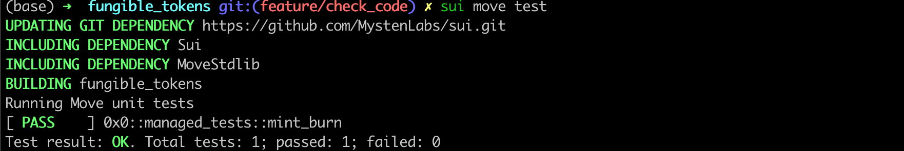

# Unit Testing

Sui รองรับ [Move Testing Framework](https://github.com/move-language/move/blob/main/language/documentation/book/src/unit-testing.md) เดี๋ยวเราจะทำการสร้าง unit tests สำหรับ `Managed Coin` เพื่อโชว์วิธีการเขียน และรันมัน

## Testing Environment

โค้ดเทสของ Sui Move นั้นก็เหมือนกับโค้ดอื่นๆของ Sui Move แต่มันจะมี annotations และ functions พิเศษเพื่อใช้แยกแยะระหว่าง production environment กับ testing environment

เริ่มต้นด้วยการใส่ annotation `#[test]` หรือ `#[test_only]` ไว้บนสุดของฟังก์ชั่น หรือโมดูลที่เราต้องการให้เป็น testing environment

```rust
#[test_only]
module fungible_tokens::managed_tests {
  #[test]
  fun mint_burn() {
  }
}
```

เราจะเขียนโค้ด unit tests สำหรับ `Managed Coin` แยกไปเป็นอีกโมดูลเพื่อใช้เทสโดยเฉพาะ ชื่อว่า `managed_tests`

แต่ละฟังก์ชั่นในโมดูลนี้สามารถมองเห็นเป็นหนึ่ง unit test ซึ่งประกอบไปด้วยธุรกรรมเดียว หรือหลายๆธุรกรรมก็ได้ เราจะลองเขียน unit test มาอันหนึ่งชื่อว่า `mint_burn`

## Test Scenario

ภายใน testing environment เราจะใช้ประโยชน์จาก แพ็คเกจ [`test_scenario` package](https://github.com/MystenLabs/sui/blob/main/crates/sui-framework/packages/sui-framework/sources/test_scenario.move) เป็นหลัก เพื่อจำลองสภาพแวดล้อมระหว่างทำงาน โดย object หลักที่เราจำเป็นต้องทำความเข้าใจ และใช้งานมันคือ `Scenario` ตัว `Scenario` จะจำลองลำดับการทำธุรกรรมหลายรายการ และสามารถใส่ค่าแอดเดรสคนทำธุรกรรมได้ดังต่อไปนี้

```rust
  // Initialize a mock sender address
  let addr1 = @0xA;
  // Begins a multi transaction scenario with addr1 as the sender
  let scenario = test_scenario::begin(addr1);
  ...
  // Cleans up the scenario object
  test_scenario::end(scenario);  
```

*💡สังเกตุว่า `Scenario` ไม่สามารถถูกลบทิ้งได้ ดังนั้นเราจึงต้องทำการล้างข้อมูลเมื่อสิ้นสุดการทำงานโดยใช้ `test_scenario::end`*

### Initializing the Module State

เพื่อทดสอบโมดูล `Managed Coin` เราต้องใส่สถานะตั้งต้นให้กับโมดูลก่อน เนื่องจากโมดูลของเรามีฟังก์ชั่น `init` เราจำเป็นต้องสร้างฟังก์ชั่นเริ่มต้นด้วย `test_only`  ภายในโมดูล `managed`:

```rust
#[test_only]
    /// Wrapper of module initializer for testing
    public fun test_init(ctx: &mut TxContext) {
        init(MANAGED {}, ctx)
    }
```

นี่เป็นการจำลองฟังก์ชั่น `init` ที่สามารถใช้สำหรับการทดสอบเท่านั้น ต่อไปเราสามารถกำหนดสถานะตั้งต้นตอนทำงานใน scenario ของเราโดยการเรียกฟังก์ชั่นนี้:

```rust
    // Run the managed coin module init function
    {
        managed::test_init(ctx(&mut scenario))
    };
```

### Minting 

เราใช้ [`next_tx` method](https://github.com/MystenLabs/sui/blob/main/crates/sui-framework/packages/sui-framework/sources/test_scenario.move#L103) เพื่อไปยังธุรกรรมถัดไปใน scenario ของเราที่ต้องการจะ mint `Coin<MANAGED>`

ในการทำเช่นนี้ เราต้องแยก object `TreasuryCap<MANAGED>` ออกมาก่อน เราจะใช้ฟังก์ชั่นพิเศษการทดสอบชื่อว่า `take_from_sender` เพื่อดึงข้อมูลนี้ออกมาจาก scenario ของเรา โปรดสังเกตุว่าเราต้องส่งประเภทของพารามิเตอร์ที่เราต้องการจะดึงข้อมูลเข้าไปใน `take_from_sender` 

จากนั้นเราก็ทำการเรียก `managed::mint` โดยใส่พารามิเตอร์ที่จำเป็นทั้งหมดให้มัน

ในตอนสุดท้ายของการทำธุรกรรมนี้ เราต้องทำการคืนค่า `TreasuryCap<MANAGED>` ไปยังคนทำธุรกรรมโดยใช้ `test_scenario::return_to_address`

```rust
next_tx(&mut scenario, addr1);
        {
            let treasurycap = test_scenario::take_from_sender<TreasuryCap<MANAGED>>(&scenario);
            managed::mint(&mut treasurycap, 100, addr1, test_scenario::ctx(&mut scenario));
            test_scenario::return_to_address<TreasuryCap<MANAGED>>(addr1, treasurycap);
        };
```

### Burning 

ในการทดสอบการเบิร์นโทเคนนั้น ขั้นตอนทั้งหมดเกือบจะเหมือนกับตอนทดสอบการมิ้นท์เป๊ะๆ ต่างแค่เราต้องดึงค่า `Coin<MANAGED>` จากคนที่มิ้นท์มันขึ้นมา

## Running Unit Tests

โค้ดเต็มๆของโมดูล [`managed_tests`](../example_projects/fungible_tokens/sources/managed_tests.move) สามารถดูได้ในโฟลเดอร์ example_projects 

ในการรัน unit tests ทำได้ง่ายๆโดยการเรียกคำสั่งนี้ใน project directory:

```bash
  sui move test
```

คุณสามารถดูผลลัพธ์ได้ว่าชุดทดสอบไหน passed หรือ failed บนคอนโซล




