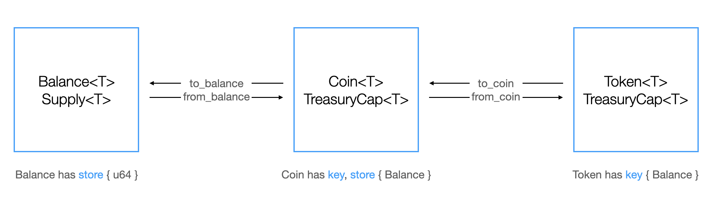

# [ส่วนเสริม] มาตรฐาน Closed Loop Token

Closed Loop Token คือมาตรฐานโทเคนบน Sui ที่อนุญาตให้ผู้ที่ deploy smart contract สามารถกำหนดนโยบายการใช้งานโทเคนได้ เช่น การควบคุมการโอน การใช้จ่าย การ mint และอื่น ๆ

## ความสัมพันธ์ระหว่าง `Coin` และ `Balance`



## การดำเนินการ (Actions)

### Public

- `token::keep` - ส่งโทเคนกลับไปยังผู้ส่งธุรกรรม
- `token::join` - รวมสองโทเคนเข้าด้วยกัน
- `token::split` - แยกโทเคนออกเป็นสองรายการ โดยระบุจำนวนที่ต้องการแยก
- `token::zero` - สร้างโทเคนที่มีมูลค่าเป็นศูนย์
- `token::destroy_zero` - ทำลายโทเคนที่มีมูลค่าเป็นศูนย์

### Protected

- `token::transfer` - โอนโทเคนไปยังที่อยู่ที่ระบุ
- `token::to_coin` - แปลงโทเคนให้เป็น Coin
- `token::from_coin` - แปลง Coin กลับมาเป็นโทเคน
- `token::spend` - ใช้โทเคนในที่อยู่ที่ระบุ

### คำขอดำเนินการ (Action Request)

การดำเนินการแบบ Protected จะสร้าง `ActionRequest` ซึ่งจำเป็นจะต้องได้รับการยืนยัน

```move
public struct ActionRequest<phantom T> {
    /// ชื่อของ Action ที่จะใช้ค้นหาใน Policy ชื่อนี้อาจเป็น
    /// action มาตรฐาน เช่น `transfer`, `spend`, `to_coin`, `from_coin`
    /// หรือจะเป็น action แบบกำหนดเองก็ได้
    name: String,
    /// จำนวน (amount) ที่ปรากฏในทุก ๆ ธุรกรรม (tx)
    amount: u64,
    /// ผู้ส่ง (sender) เป็นฟิลด์ถาวรเสมอ
    sender: address,
    /// ผู้รับ (recipient) ใช้งานได้เฉพาะใน action `transfer`
    recipient: Option<address>,
    /// ยอดคงเหลือที่จะถูก “ใช้จ่าย” (spent) ใน `TokenPolicy`
    /// ใช้งานได้เฉพาะใน action `spend`
    spent_balance: Option<Balance<T>>,
    /// การอนุมัติ (stamps) ที่ถูกรวบรวมมาจาก `Rules` ที่ทำสำเร็จ
    /// จะถูกนำมาเทียบกับ `TokenPolicy.rules` เพื่อพิจารณาว่า
    /// คำร้องนี้สามารถยืนยันได้หรือไม่
    approvals: VecSet<TypeName>,
}
```

## การยืนยันคำขอ (Confirming Action Requests)

มีอยู่ 3 วิธีที่ใช้ยืนยันคำขอ

- โดย `TreasuryCap`
- โดย `TokenPolicyCap`
- ผ่าน token policy ที่กำหนดไว้ล่วงหน้า

## Settiการตั้งค่า Token Policy

- สร้าง Coin โดยใช้ `coin::create_currency`
- สร้าง policy สำหรับโทเคนนั้นผ่าน `token::new_policy`
- แชร์ object `TokenPolicy`
- สร้าง rules ให้แต่ละ actions ตามต้องการ
- บันทึก, แก้ไข, หรือลบ rules ผ่าน `TokenPolicy`

### โครงสร้างลำดับชั้น

`Coin/Token Type` -> `TokenPolicy` -> `Rules`

## ตัวอย่าง Parity Token


นี่คือตัวอย่าง closed loop token อย่างง่าย เพื่อแสดงให้เห็นว่าการกำหนดและใช้งาน token policy ทำได้อย่างไร

ตัวอย่างนี้อนุญาตให้ mint โทเคนได้เฉพาะจำนวนที่มีค่าเป็นเลขคี่เท่านั้น (odd parity amounts)

### การกำหนดและการเพิ่ม Token Policy

Token policy เฉพาะนี้ถูกกำหนดไว้ในสัญญา [parity_rule.move](../example_projects/closed_loop_token/sources/parity_rule.move)

จากนั้น rule นี้จะถูกเพิ่มเข้าไปในโทเคน `PARITY` ที่กำหนดไว้ ภายในฟังก์ชัน `init` ของสัญญา [parity.move](../example_projects/closed_loop_token/sources/parity.move)

### สัญญาฉบับเต็ม

โปรเจกต์ตัวอย่าง Parity Token ฉบับเต็มสามารถดูได้ที่นี่: [Parity Token](../example_projects/closed_loop_token/)
