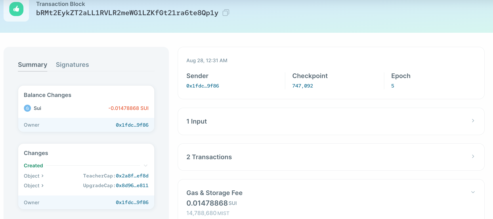

# รูปแบบการออกแบบความสามารถ (Capability Design Pattern)

ตอนนี้เรามีพื้นฐานของระบบการเผยแพร่ transcript แล้ว ต่อไปเราจะทำการเพิ่มระบบการควบคุมการเข้าถึงให้กับสมาร์ทคอนแทรคของเรา

ความสามารถ (Capability) เป็นรูปแบบที่ใช้กันทั่วไปใน Move ซึ่งอนุญาตให้เราปรับแต่งการควบคุมการเข้าถึงโดยใช้โมเดลที่มีวัตถุเป็นศูนย์กลาง มาดูกันว่าเราสามารถกำหนดความสามารถให้วัตถุได้อย่างไร:

```move
// Type that marks the capability to create, update, and delete transcripts
public struct TeacherCap has key {
    id: UID
}
```

เราประกาศ struct อันใหม่ ชื่อ `TeacherCap` เพื่อใช้กำหนดขีดความสามารถในการดำเนินการใดๆกับ transcript ถ้าเราไม่ต้องการให้ความสามารถนี้ถูกถ่ายโอนได้ ก็เพียงแค่ไม่ต้องเพิ่ม `storage` ให้มัน

*💡หมายเหตุ: นี่เป็นวิธีที่เทียบเท่ากับการทำ soulbound tokens (SBT) ใน Move คุณเพียงแค่ประกาศ struct ที่มี `key` แต่ไม่ต้องมี `store`

## Passing and Consuming Capability Objects

ถัดไป เราต้องทำการแก้ไขเมธอดที่จะถูกเรียกใช้โดยใครก็ตามที่มีความสามารถ `TeacherCap` เพื่อรับ capability เป็นพารามิเตอร์เพิ่มเติม

ตัวอย่างเช่น เราสามารถเขียนเมธอด `create_wrappable_transcript_object` ได้ดังนี้:

```move
public fun create_wrappable_transcript_object(
    _: &TeacherCap,
    history: u8,
    math: u8,
    literature: u8,
    ctx: &mut TxContext,
) {
    let wrappable_transcript = WrappableTranscript {
        id: object::new(ctx),
        history,
        math,
        literature,
    };
    transfer::public_transfer(wrappable_transcript, ctx.sender())
}
```

เราส่ง reference ของ `TeacherCap` เข้าไปให้ฟังก์ชั่น โดยแทนชื่อตัวแปรด้วยเครื่องหมาย `_` เนื่องจากเป็นพารามิเตอร์ที่ไม่ได้เรียกใช้งาน และโปรดสังเกตุว่าการที่เราส่งเป็น reference เข้าไป การใช้งานใดๆจะไม่ส่งผลกระทบไปยัง object ดั้งเดิมของมัน

*แบบทดสอบ: จะเกิดอะไรขึ้นถ้าเราส่งค่า `TeacherCap` เข้าไป*

นี่หมายความว่ามีแค่แอดเดรสที่ TeacherCap สามารถเรียกเมธอดนี้ได้ มีการ implement การควบคุมการเข้าถึงบนเมธอดนี้

เราได้ทำการแก้ไขสิ่งที่คล้ายๆกันนี้ให้กับเมธอดอื่นๆทั้งหมดในคอนแทรคที่จะมีการดำเนินการพิเศษกับ transcript

## Initializer Function

ฟังก์ชั่นเริ่มต้น (initializer function) ของโมดูล จะถูกเรียกเมื่อเราทำการเผยแพร่โมดูลออกไป สิ่งนี้มีประโยชน์สำหรับการตั้งค่าสถานะเริ่มต้นให้กับสมาร์ทคอนแทรค และมักใช้เพื่อส่งชุดของความสามารถ (capability) ออกไป

ในตัวอย่างของเรา เราสามารถเขียนฟังก์ชั่น `init` ได้ดังนี้:

```move
/// Module initializer is called only once on module publish.
fun init(ctx: &mut TxContext) {
    transfer::transfer(TeacherCap {
        id: object::new(ctx)
    }, ctx.sender())
}
```

สิ่งนี้จะทำการคัดลอก `TeacherCap` และส่งไปยังแอดเดรสที่เผยแพร่คอนแทรคนี้เมื่อโมดูลถูกเผยแพร่ออกไปครั้งแรก

เราสามารถดูความเปลี่ยนแปลงของการเผยแพร่บน Sui Explorer [Sui Explorer](../../unit-one/lessons/6_hello_world.md#viewing-the-object-with-sui-explorer) ได้ด้านล่าง:



วัตถุอีกตัวที่ถูกสร้างจากธุรกรรมด้านบนคือ `TeacherCap` และถูกส่งไปยังแอดเดรสที่เผยแพร่:


*แบบทดสอบ: วัตถุแรกที่ถูกสร้างขึ้นมาคืออะไร?*

## เพิ่ม Teachers หรือ Admins เพิ่มเติม

ในการเพิ่มให้แอดเดรสอื่นๆถึงได้มากขึ้น เราสามารถทำได้ง่ายๆโดยเขียนเมธอดสำหรับสร้าง และส่ง `TeacherCap` เพิ่มเติม ดังนี้:

```move
public fun add_additional_teacher(
    _: &TeacherCap,
    new_teacher_address: address,
    ctx: &mut TxContext,
) {
    transfer::transfer(
        TeacherCap {
            id: object::new(ctx),
        },
        new_teacher_address,
    )
}
```

เมธอดนี้ทำการใช้ซ้ำตัว `TeacherCap` เพื่อควบคุมการเข้าถึง แต่ถ้าต้องการ คุณยังสามารถเขียนความสามารถ (capability) อันใหม่เพื่อกำหนดสิทธิ์การเข้าถึงระดับ super user ได้เช่นกัน

**นี่คือโค้ดเต็มๆ เวอร์ชั่นที่สามของสิ่งที่เราทำกันมาจนถึงตอนนี้: [WIP transcript.move](../example_projects/transcript/sources/transcript_3.move_wip)**
