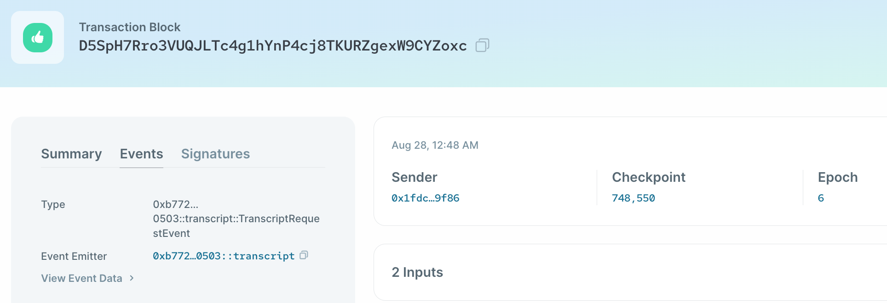
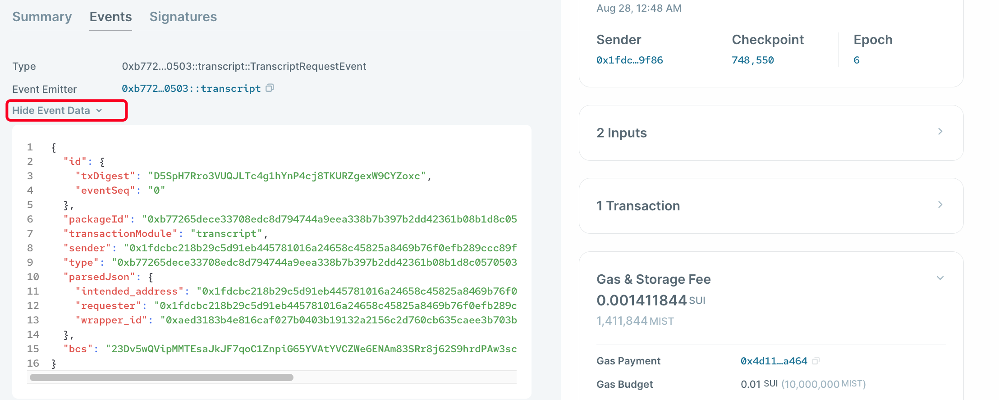

# เหตุการณ์ (Events)

เหตุการณ์ (Events) มีความสำคัญอย่างมากต่อสมาร์ทคอนแทรคใน Sui Move เนื่องจากเป็นช่องทางหลักเพื่อให้ indexers ใช้ติดตามการะกระทำต่างๆที่เกิดขึ้นบนเชน เปรียบง่ายๆคล้ายกับการทำ logging บนเซิฟเวอร์ โดยที่ indexers คือคนวิเคราะห์แยกแยะ logs

Events บน Sui ก็ถือเป็นวัตถุชนิดหนึ่ง ซึ่ง Events ในระดับ system มีหลากหลายประเภท ประกอบไปด้วย Move event, Publish event, Transfer object event และอื่นๆ สำหรับรายชื่อ system events ทั้งหมดสามารถดูได้ที่ [Sui Events API page here](https://docs.sui.io/build/event_api)

รายละเอียด event ของ transaction สามารถดูได้ที่ [Sui Explorer](https://explorer.sui.io/) ภายใต้แท็ป `Events`:



## Custom Events

ผู้พัฒนายังสามารถสร้าง custom events ได้เอง เราสามารถสร้าง custom events เพื่อใช้ระบุว่า transcript มีการถูกร้องขอได้ ดังต่อไปนี้

```move
/// Event marking when a transcript has been requested
public struct TranscriptRequestEvent has copy, drop {
    // The Object ID of the transcript wrapper
    wrapper_id: ID,
    // The requester of the transcript
    requester: address,
    // The intended address of the transcript
    intended_address: address,
}
```

Event นี้ประกอบไปด้วย abilities `copy` และ `drop` โดย Event ไม่ใช่ assets และเราจะสนใจเฉพาะข้อมูลที่อยู่ข้างใน ดังนั้นมันสามารถถูกคัดลอก หรือลบทิ้ง เมื่อสิ้นสุดการใช้งานได้

การ emit event ใน Sui ทำได้โดยเรียกใช้ [`sui::event::emit` method](https://github.com/MystenLabs/sui/blob/main/crates/sui-framework/docs/event.md#function-emit).

มาแก้ไขฟังก์ชั่น `request_transcript` เพื่อให้ emit event กัน:

```move
public fun request_transcript(
    transcript: WrappableTranscript,
    intended_address: address,
    ctx: &mut TxContext,
) {
    let folder_object = Folder {
        id: object::new(ctx),
        transcript,
        intended_address,
    };
    event::emit(TranscriptRequestEvent {
        wrapper_id: folder_object.id.to_inner(),
        requester: ctx.sender(),
        intended_address,
    });
    // e transfer the wrapped transcript object directly to the intended address
    transfer::transfer(folder_object, intended_address);
}
```

บน Sui explorer เราสามารถเห็น event ที่ถูก emit แสดงดังข้างล่างนี้ จะเห็นว่ามันจะแสดงสามฟิลด์ที่เราประกาศไว้ใน `TranscriptRequestEvent`:



**นี่คือโค้ดฉบับสมบูรณ์ของตัวอย่างโปรเจค transcript: [transcript.move](../example_projects/transcript/sources/transcript.move)**

ทดลองสร้าง ร้องขอ แกะ transcripts โดยใช้ Sui CLI และดูผลลัพธ์บน Sui explorer

จบบทที่ 2 แล้ว เยี่ยมมาก!